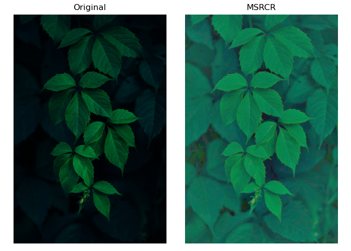
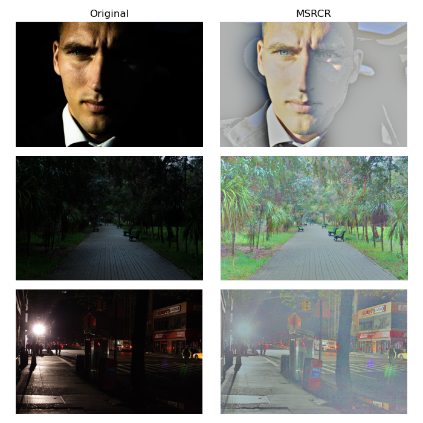

# Retinex

Retinex algorithms for image enhancement. They are specially useful to process images with uneven illumination.

Still a work in progress. Next, I want to implement other techniques for color correction.

## Installation

You may use pip to install retinex.

```bash
pip install retinex
```

## Usage

Here is an example of how to use MSRCR (multi-scale retinex with color correction).

```python
import skimage
from retinex import msrcr

img_original = skimage.io.imread("leaves.jpg")
img_msrcr = msrcr(img, sigmas=(25., 50., 100.,))

```



Check the `examples` folder for some more samples:




## Image credits

Images in the `sample_images` folder were made freely available online by talented photographers. My big thanks to them:

- leaves.jpg: Photo by <a href="https://unsplash.com/@frostroomhead?utm_content=creditCopyText&utm_medium=referral&utm_source=unsplash">Rodion Kutsaiev</a> on <a href="https://unsplash.com/photos/closeup-photo-of-green-leafed-plant-049M_crau5k?utm_content=creditCopyText&utm_medium=referral&utm_source=unsplash">Unsplash</a>
- man.jpg: Photo by <a href="https://unsplash.com/@usmcmcauliffe?utm_content=creditCopyText&utm_medium=referral&utm_source=unsplash">Michael McAuliffe</a> on <a href="https://unsplash.com/photos/close-up-photo-of-mans-face-QnfePA4j-IQ?utm_content=creditCopyText&utm_medium=referral&utm_source=unsplash">Unsplash</a>
- park.jpg: Photo by <a href="https://unsplash.com/@destroyer25t?utm_content=creditCopyText&utm_medium=referral&utm_source=unsplash">Oleg Lukin</a> on <a href="https://unsplash.com/photos/black-wooden-table-with-chairs-2TKwdWZLUug?utm_content=creditCopyText&utm_medium=referral&utm_source=unsplash">Unsplash</a>
- street.jpg: Photo by <a href="https://www.flickr.com/photos/rondouglas/">
Ron Douglas</a> on <a href="https://flic.kr/p/dpURCr">flickr</a>

## References

1. Rahman, Z. U., Jobson, D. J., & Woodell, G. A. (2004). [Retinex processing for automatic image enhancement](https://cs.wellesley.edu/~cs332/imageEnhance.pdf). Journal of Electronic imaging, 13(1), 100-110.

## Contributing

Pull requests are welcome. For major changes, please open an issue first
to discuss what you would like to change.

Please make sure to update tests as appropriate.

## License

[MIT](https://choosealicense.com/licenses/mit/)


<!-- Markdown link & img dfn's -->
[npm-image]: https://img.shields.io/npm/v/datadog-metrics.svg?style=flat-square
[npm-url]: https://npmjs.org/package/datadog-metrics
[npm-downloads]: https://img.shields.io/npm/dm/datadog-metrics.svg?style=flat-square
[travis-image]: https://img.shields.io/travis/dbader/node-datadog-metrics/master.svg?style=flat-square
[travis-url]: https://travis-ci.org/dbader/node-datadog-metrics
[wiki]: https://github.com/yourname/yourproject/wiki